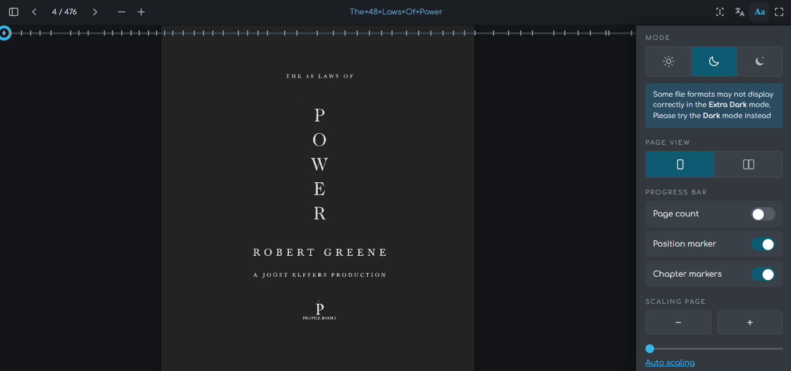

# OpenLitera – PDF Reader with Translation

A dark‑mode PDF reader that lets you translate any document **while preserving the original layout**.
Built as a single HTML file – no installation, no build step.




## ✨ Features

- **True dark mode** – inverts PDF pages, not just the UI.
- **Translation on the fly** – multiple engines:
  - On‑device (Chrome/Edge desktop, offline)
  - Google Translate (free endpoint)
  - Lingva (open‑source proxy)
  - MyMemory (free tier)
  - LibreTranslate (self‑hosted)
- **Two translation views**:
  - **List view** – source and translation side‑by‑side.
  - **Page view** – translation overlaid directly on the PDF (layout‑preserving).
- **Full navigation** – thumbnails, chapter markers, zoom, rotation, two‑page spread.
- **Text selection & copy** – select text from the PDF.
- **Offline cache** – translations are stored locally (IndexedDB).

## 🚀 Live demo

[Try it now](https://softexq.github.io/OpenLitera/)  
(Enable GitHub Pages after pushing – see instructions below)

## 📖 How to use

1. Open `index.html` in a modern browser (Chrome, Edge, Firefox, Safari).
2. Click **Open a PDF** or drag‑and‑drop a PDF file.
3. Use the toolbar to navigate, zoom, and rotate.
4. Click the **Translate** button (globe icon) to activate translation.
5. Choose languages in the settings panel (Aa icon).
6. Switch between **List** and **Page** view in the settings or via the toolbar toggle.
7. Click **Translate all** to process the entire document.

## 🛠️ Installation (for developers)

```bash
git clone https://github.com/softexq/OpenLitera.git
cd OpenLitera
# Open index.html in your browser
